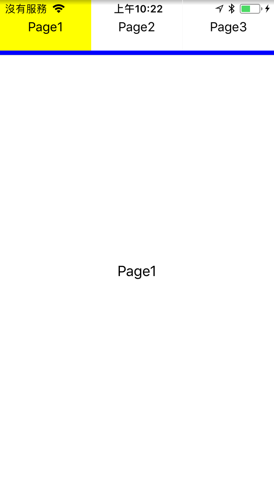

# IRTabbedPageViewController 

- IRTabbedPageViewController is a powerful tab view controller for iOS.

## Features
IRTabbedPageViewController is a UIViewController that provides a simple to implement page view controller with scrolling tab bar. It also includes a UIPageViewController wrapper that provides improved data source and delegation methods.

## Install
### Git
- Git clone this project.
- Copy this project into your own project.
- Add the .xcodeproj into you  project and link it as embed framework.
#### Options
- You can remove the `demo` and `ScreenShots` folder.

### Cocoapods
- Add `pod 'IRTabbedPageViewController'`  in the `Podfile`
- `pod install`

## Usage

### Basic

To use the tabbed page view controller, simply create a `UIViewController` that is a subclass of `IRTabbedPageViewController`. Then implement the following data source method:

```obj-c
// array of view controllers to display in page view controller
- (NSArray *)viewControllersForPageViewController:(IRPageViewController *)pageViewController;
```

If you are using a `UINavigationController` (As shown in Example project) you can embed the tab bar in the navigation bar. Simply set the `UINavigationBar` class in the navigation controller to `IRTabNavigationBar` and the navigation bar will attach to the view controller.

To manually attach a tab bar view to the `IRTabbedPageViewController`:

- Set the `tabBarView` property of the `IRTabbedPageViewController` to an `IRTabBarView` instance (Note: `tabBarView` is weak and an `IBOutlet`).
- Set the `dataSource` and `delegate` properties of the `IRTabBarView` instance to the `IRTabbedPageViewController` (Both are `IBOutlet`able).

To customise the content of the tabs in the tab bar override the following:

```obj-c
- (void)tabBarView:(IRTabBarView *)tabBarView
       populateTab:(IRTabBarCollectionViewCell *)tab
           atIndex:(NSInteger)index;
```

### Advanced settings

IRPageViewController is a UIViewController wrapper for UIPageViewController that provides a simpler data source and enhanced delegation methods. The data source methods are encapsulated in the `IRTabbedPageViewControllerDataSource` as seen above.

The delegate methods that `IRPageViewControllerDelegate` provides are listed below:

```obj-c
- (void)pageViewController:(IRPageViewController *)pageViewController
     didScrollToPageOffset:(CGFloat)pageOffset
                 direction:(IRPageViewControllerScrollDirection)scrollDirection;
```
Called when the page view controller is scrolled by the user to a specific offset, similar to `scrollViewDidScroll`. The pageOffset maintains the current page position and a scroll direction is provided.

```obj-c
- (void)pageViewController:(IRPageViewController *)pageViewController
           didScrollToPage:(NSInteger)page;
```
Called when the page view controller completes a full scroll to a new page.

### Appearance
`IRTabBarView` provides properties for appearance customisation, including:
- `sizingStyle` - Whether the tab bar should size to fit or equally distribute its tabs.
- `tabStyle` - The styles to use for tabs:
    - `IRTabStyleText` for text.
    - `IRTabStyleImage` for images.
    - `IRTabStyleImageAndText` for images and text.
    - `IRTabStyleCustomView` for custom view.
- `indicatorStyle` - The style to use for the current tab indicator.
- `indicatorAttributes` - Appearance attributes for current tab indicator.
- `tabAttributes` - Appearance attributes for tabs.
- `selectedTabAttributes` - Appearance attributes for the selected tab.
- `selectionIndicatorTransitionStyle` - The transition style for the selection indicator.
 - `IRTabTransitionStyleProgressive` to progressively transition between tabs.
 - `IRTabTransitionStyleSnap` to snap between tabs during transitioning.
 - use `setTransitionStyle:` to set both the `selectionIndicatorTransitionStyle` and `tabTransitionStyle`.
- `tabTransitionStyle` - The transition style to use for the tabs.

#### Custom Tab Style
Set custom tab view in the `IRTabBarViewDataSource`.

```obj-c
#pragma mark - IRTabBarViewDataSource
- (void)tabBarView:(IRTabBarView *)tabBarView populateTab:(IRTabBarCollectionViewCell *)tab atIndex:(NSInteger)index {
    tab.customView = YOUR_CUSTOM_TAB_VIEW;
}
```

## Screenshots
  

## Copyright
##### This project is inspired from [MSSTabbedPageViewController](https://github.com/msaps/MSSTabbedPageViewController).
